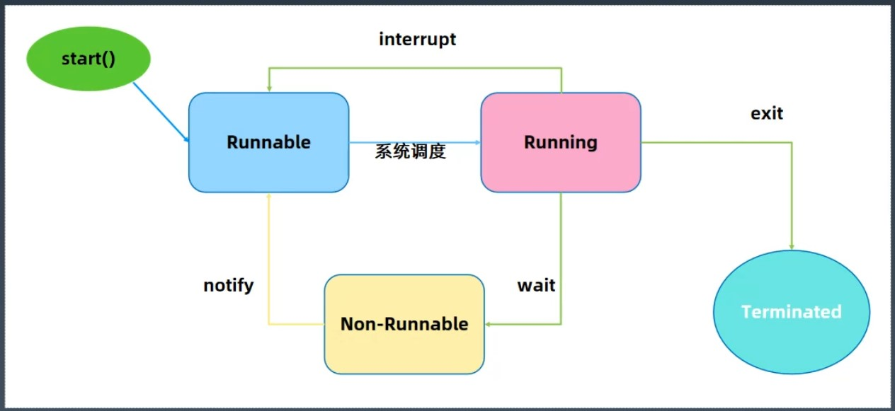

06-Java并发编程
---
1. 为什么会有多线程

硬件发展的太快了，最近20年的CPU主频上不去了，就需要找一堆机器干同一个活，这个就是分布式的根本来源

多核+分布式时代

多CPU核心意味着同时操作系统有更多的并行计算资源可以使用，操作系统以线程作为基本的调度单元。

单线程是最好处理不过的，线程越多，管理复杂度越高。

2. 线程和进程的区别
- 传统的回答
    * 进程是运行中的程序，线程是进程的内部的一个执行序列
    * 进程是资源分配的单元，线程是执行单元
    * 进程间切换代价大，线程间切换代价小
    * 进程拥有资源多，线程拥有资源少
    * 多个线程共享进程的资源
- 在linux系统中，一切皆文件，线程和进程其实没有明显的区别，都对应的是一个文件路径，进程可以有多个子进程。此时多个子进程可以绑定到一个端口上。

3. Java里创建线程的过程(要映射到系统线程)

Thread.start()--JavaThread--OSthread--Stack--TLAB--启动--Thread#run()--终结

run()就是一个普通的方法，只有执行了start()方法之后，才开始执行线程。

4. java线程基础(☆)

- 创建线程的两个办法 
    * new Thread()
    * new Runnable()
- 守护线程 = 守护线程：为所有非守护线程提供服务的线程；换句话说，任何一个守护线程都是整个JVM中所有非守护线程的保姆
```
// 因为设置为守护线程，start()的时候发现没有用户线程，守护线程就直接退出了，不会执行上面的run()方法
public static void main(String[] args) {
    Runnable task =
        new Runnable() {
          @Override
          public void run() {
            try {
              Thread.sleep(2000);
            } catch (InterruptedException e) {
              e.printStackTrace();
            }
            Thread t = Thread.currentThread();
            System.out.println("当前线程：" + t.getName());
          }
        };
    Thread thread = new Thread(task);
    thread.setName("bobook-thread-1");
    thread.setDaemon(true);
    thread.start();
  }
```
- Runnable接口和Thread类
    * Thread实现了Runnable接口
    
- 线程状态

   
   - runnable状态，CPU不忙的时候，可以立即执行
   - Non-Runnable状态，和CPU此时没什么关系，被阻塞了
   
- Thread类
    * volatile String name;线程名称，诊断分析使用
    * boolean daemon = false;后台守护线程标志-决定JVM优雅关闭
    * Runnable target;任务(智能通过构造函数传入)
    * synchronized void start();【协作】启动新线程并自动执行
    * void join();【协作】等待某个线程执行完毕(来汇合)
    * static native Thread currentThread();静态方法，获取当前线程信息
    * static native void sleep(long millis);静态方法，线程睡眠并让出CPU时间片
- wait & notify
    * void wait();放弃锁+等待0ms+尝试获取锁
    * void wait(long timeout,int nanos);放弃锁+wait+到时间自动唤醒/中途唤醒(精度:nanos>0则timeout++)
    * native void wait(long timeout);放弃锁+wait+到时间自动唤醒/中途被唤醒(唤醒之后需要自动获取锁)
    * native void notify();发送信号通知1个等待线程
    * native void notifyAll();发送信息通知所有等待线程
- Object#wait pk Thread.sleep
    * Thread.sleep:释放CPU
    * Object#wait:释放锁
- Thread的状态改变操作
    * Thread.sleep(long millis),一定是当前线程调用此方法，当前线程进入TIMED_WAITING状态，但不释放对象锁，millis后线程自动苏醒进入就绪状态，作用：给其他线程执行机会的最佳方式
    * Thread.yield(),一定是当前线程调用此方法，当前线程放弃获取的CPU时间片，但不释放锁资源，由运行状态变成就绪状态，让os再次选择。
    * t.join()/t.join(long millis),当前线程里调用其他线程t的join方法，当前线程进入WAITING/TIMED_WAITING状态，当前线程不会释放已经持有的对象锁，线程t执行完毕或者millis时间到，当前线程进入就绪状态。
    * obj.wait(),当前线程调用对象的wait()方法，当前线程释放对象锁，进入等待队列，依靠notify()/notifyAll()唤醒或者wait(long timeout) timeout时间到自动唤醒。
    * obj.notify()唤醒在此对象监视器上等待的单个线程，选择是任意性的，notifyAll()唤醒在此对象监视器上的所有等待的线程。
- Thread的中端   