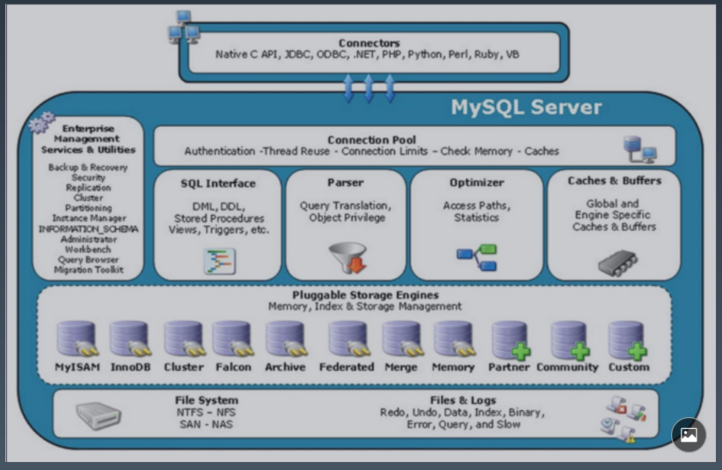

 聊聊性能、数据库原理配置和设计
 ---
 
 1. 聊聊性能
 
 - 性能是一个复杂的问题
    * 吞吐与延迟:有些结论是反直觉的，指导我们关注什么
    * 没有量化就没有改进：监控与度量指标，指导我们怎么去入手
    * 80/20原则：先优化性能瓶颈问题，指导我们如何去优化
    * 过早的优化是万恶之源：指导我们要选择优化的时机
    * 脱离场景谈性能都是耍流氓：指导我们对性能要求要符合实际
 - DB/SQL 优化是业务系统性能优化的核心
    * 业务系统的分类：计算密集型、数据密集型
    * 业务处理本身无状态，数据状态最终要保存到数据库
    * 一般来说，DB/SQL 操作的消耗在一次处理中占比最大
    * 业务系统发展的不同阶段和时期，性能瓶颈要点不同，类似木桶装水 
 
 2. 关系型数据库Mysql
 - E-R图：Entity-Relationship
 - 几个常见的as a Service
   * SaaS 软件即服务，功能软件从单机版编程web多租户
   * PaaS 平台即服务，基础设施都是共享的，自己去部署应用，Google的GAE SAE
   * IaaS 云平台，openstack 容器化，Infrastructure as Service 基础架构即服务，看起来你拿到的就是机器，自己按任何东西
   * Faas Serverless 函数即服务，---》 headless无头技术
   * DaaS data 数据即服务，还，没有成熟的模式
 - 数据库设计范式
   * 第一范式：每个属性A都只包含原子项，---每一列不可以再分的基本数据项，比如姓名+学号
   * 第二范式：消除非主属性对码的部分函数依赖 ---每一行都被逐渐唯一标识，比如学号-成绩；学号-系名
   * 第三范式：消除非主属性对码的传递函数依赖 ---依赖表中的非主键列的情况，即没有列是与主键不相关的。比如学号和系主任
   * BC范式：消除主属性对码的部分和传值依赖 
   * 第四范式：消除非平凡的多值依赖
   * 第五范式：消除一些不合适的连接依赖
 - 常见数据库
   * 开源：MySQL、PostgreSQL
   * 商业：Oracle，DB2，SQL Server
   * 内存数据库：Redis，VoltDB
   * 图数据库：Neo4j，Nebula ---
   * 时序数据库：InfluxDB、openTSDB ---一般用户监控打点
   * 其他关系数据库：Access、Sqlite(C嵌入式写的)、H2(基于内存的)、Derby(java写的，apache项目)、Sybase、Infomix 等
   * NoSQL 数据库：MongoDB、Hbase、Cassandra、CouchDB
   * NewSQL/ 分布式数据库：TiDB、CockroachDB、NuoDB、OpenGauss、OB、TDSQL
 - SQL语言分为6个部分
   * 1、数据查询语言（DQL: Data Query Language）：其语句，也称为“数据检索语句”，用以从表中获得数据，确定数据怎样在应用程序给出。保留字 SELECT 是 DQL（也是所有 SQL）用得最多的动词，其他 DQL 常用的保留字有 WHERE，ORDER BY，GROUP BY 和 HAVING。这些 DQL保留字常与其它类型的 SQL 语句一起使用。
   * 2、数据操作语言（DML：Data Manipulation Language）：其语句包括动词 INSERT、UPDATE 和 DELETE。它们分别用于添加、修改和删除。
   * 3、事务控制语言（TCL）：它的语句能确保被 DML 语句影响的表的所有行及时得以更新。包括COMMIT（提交）命令、SAVEPOINT（保存点）命令、ROLLBACK（回滚）命令。
   * 4、数据控制语言（DCL）：它的语句通过 GRANT 或 REVOKE 实现权限控制，确定单个用户和用 户组对数据库对象的访问。某些 RDBMS 可用 GRANT 或 REVOKE 控制对表单个列的访问。
   * 5、数据定义语言（DDL）：其语句包括动词 CREATE,ALTER 和 DROP。在数据库中创建新表或修改、删除表（CREAT TABLE 或 DROP TABLE）；为表加入索引等。
   * 6、指针控制语言（CCL）：它的语句，像 DECLARE CURSOR，FETCH INTO 和 UPDATE WHERE CURRENT 用于对一个或多个表单独行的操作。
 - SQL Parser
   * 手写，druid mycat
   * antlr4 shardingsphere
   * yacc mysql tidb cockeroachdb
 - Mysql版本
   * 4.0支持 InnoDB，事务
   * 2003年，5.0
   * 5.6 ==> 历史使用最多的版本
   * 5.7 ==> 近期使用最多的版本---最好的学习版本
   * 8.0 ==>最新和功能完善的版本
 - 5.6/5.7的差异
   * 多主
   * MGR 高可用
   * 分区表
   * json
   * 性能
   * 修复 XA 等
 - 5.7/8.0的差异
   * 通用表达式
   * 窗口函数
   * 持久化参数
   * 自增列持久化
   * 默认编码 utf8mb4
   * DDL 原子性
   * JSON 增强
   * 不再对 group by 进行隐式排序？？==> 坑
3. 深入数据库原理
 - Mysql架构图(Connector-->Connection Pool-->SQL interface-->Parser-->Optimizer-->Cache & Buffers-->执行引擎)
 
 - 独占模式存储
   * 日志组文件：ib_logfile0和ib_logfile1，默认均为5M
   * 表结构文件：*.frm
   * 独占表空间文件：*.ibd
   * 字符集和排序规则文件：db.opt
   * binlog 二进制日志文件：记录主数据库服务器的 DDL 和 DML 操作
   * 二进制日志索引文件：master-bin.inde
 - 共享模式innodb_file_per_table=1
   * 数据都在 ibdata1
 - 一次简化的执行流程
   * 查询缓存，看有没有，有的话直接返回结果
   * 没有命中缓存，则解析器，形成一个解析树
   * 预处理，优化解析树
   * 查询优化器。生成执行计划
   * 查询执行引擎，选择执行引擎
   * 请求数据，得到结果
 - 不同引擎的差异
  
   
 - Mysql对Sql的执行顺序
   * from-on-join-where-group by-having-select-order by-limit
 - Mysql的索引原理
   * 数据是按页来分块的，当一个数据被用到是，其附近的数据通常也会被马上被使用
   * InnoDb使用B+树实现聚集索引
   * 为什么一般表单数据不超过2000万，一页是16K，一个主键有6+8=14个字节，一层最多存储16000/14=1170.三层是
 4. Mysql配置优化
 - 
 
 